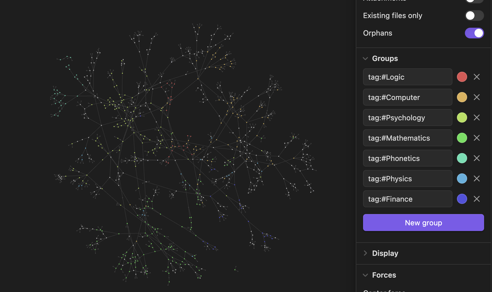

# What is GPTVault?
A program that iteratively builds a knowledge base using GPT-3.5.

> Read more about GPTVault through its [Article](https://davidewiest.medium.com/gptvault-building-a-knowledge-base-with-gpt-3-5-bd91fb806260)

### Why is this useful?
You can build a usable vault from scratch by giving the program just the topic name(s).
You can also modify the program to fit your needs. (See the section below)

# Demo
Using the Obsidian Graph view

- In total 1000+ Files
- Total Cost: Ca. 1€
- Starting concept: "Knowledge"

### Why is this interesting?
You can see how concepts are arranged, what hierarchy exists, and use Obsidian-Plugins like [Graph Analysis](obsidian://show-plugin?id=graph-analysis) to gain further info.

### How does it work?
- The program starts with a set of concepts
- It asks GPT-3.5 to complete a json-file about this concept, in which further concepts are referenced
- Using this new list of concepts, the process gets repeated until a specified depth has been reached
- By default, these json files will automatically be converted to markdown-files, which you can use 

# How can I use this?
1. Install required packages: `pip3 install -m requirements.txt`
2. Set the environment variable `OPENAI_API_KEY` to your api key.
3. Execute `generator.py`. If you are using this for the first time, use `new` as usage-type.
4. You will then be prompted to give it some concepts to start with. Choose freely.

### How can I customize this?
- Customize the prompt located in `generator_files/prompt.txt`. (As long as GPT-3.5 will repond with the required json string, the program will work.)
- Customize the intermediary json file structure located in `generator_files/template.json`. (You will need to replace the keys in the program.)
- Change the OpenAI-API request params in the `makeResponse` fn in `generator.py`
- Turn off the auto-conversion to markdown, and keep only the json-files

Since this program is relatively simple, you can even change its basic behavior. You could, for example, use it to write a sequence of related blogs/stories.

### Limitations
- Does not account for synonyms
- Needs to be stopped manually in the usage-mode `new`

